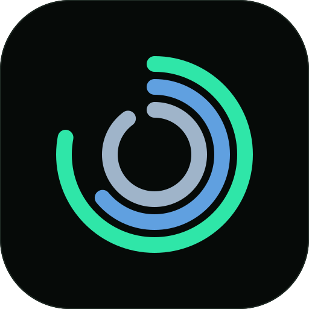

<p align="center">
  
</p>

<h1 align="center">NOOP AI</h1>

<p align="center"><b>Your WHOOP data, on your own devices, with a coach that remembers.</b></p>

<p align="center">
  
  
  
  
  <a href="LICENSE"></a>
</p>

<p align="center">
  
</p>

---

<!--
MAINTAINER NOTE — update this small release section for every beta or public release:
1. Change the badge and heading version.
2. Keep three or fewer concrete highlights.
3. Move shipped items out of “In development” and link the matching release note.
-->

## Latest beta — 9.2.1 DX Beta

- **The coach now has real long-term memory.** An on-device semantic index lets it recall past
  conversations and journal entries by meaning, not just exact wording — nothing leaves your device,
  and it stays off until you turn it on.
- **Privacy is three taps, not nine.** Data access collapses into three understandable modes —
  Essentials, Personal, Deep insights — plus an Expert mode for the individual switches. Sensitive
  journal topics always need their own separate, explicit choice.
- **Unsigned iOS IPA, signed by you.** Install through AltStore or SideStore. NOOP AI does not use an
  Apple team, certificate, or personal signing name to distribute the build.

Read the full [9.2.1 DX Beta notes](docs/releases/v9.2.1-dx-beta.md).

## In development

- **Android distribution.** The Android source is version-aligned with 9.2.1; a public Android beta
  download will follow in a later rollout.
- **More practical alert history.** The inbox will keep evolving around events that actually happened,
  rather than becoming a second copy of scheduled reminders.

## Download and install

### iPhone and iPad — DX Beta

The iOS build is an **unsigned IPA on purpose**. Add the source below in AltStore or SideStore, then
the sideloader signs the app locally with the Apple ID you choose. NOOP AI never receives your Apple ID
or a signing certificate.

**Source URL:**

```
https://raw.githubusercontent.com/DX23876/noop/main/altstore-source.json
```

- **AltStore:** Browse → **+** → paste the source URL → add NOOP AI.
- **SideStore:** Sources → **+ Add Source** → paste the same URL → install NOOP AI.
- Prefer a direct file? Download `NOOP-ios-unsigned-v9.2.1-dx-beta.ipa` from the
  [DX Beta prerelease](https://github.com/DX23876/noop/releases/tag/v9.2.1-dx-beta).

See [the iOS install guide](docs/IOS.md) for the free-Apple-ID limits, widget notes, and build-from-source
instructions.

### Platform status

| Platform | Status | Distribution |
|---|---|---|
| iOS / iPadOS | 9.2.1 DX Beta | AltStore, SideStore, or build from source |
| macOS | Source build | Build with Xcode; a packaged beta follows separately |
| Android | Distribution in progress | Source version aligned; public beta follows later |

## What NOOP AI does

| | |
|---|---|
| ⌚ **Own your strap data** | Connect directly to a WHOOP 4.0 or 5.0/MG over Bluetooth. No WHOOP account, subscription, or cloud relay. |
| 📈 **Compute locally** | Charge, Effort, Rest, sleep, HRV, heart rate, recovery trends, and correlations are calculated and stored on your device. |
| 🤖 **Use a coach with context** | The optional coach can reason over the local data you explicitly allow, remember goals and preferences, and propose rather than impose a plan. |
| 🔒 **Keep control** | No telemetry, no NOOP account, and no server. The optional coach only contacts the provider and API key you configure when you send a message. |
| 📬 **See what happened** | Today and the bell keep daily signals, important status, and recent alerts visible without turning every event into noise. |

## Privacy, precisely

NOOP AI is offline-first. Your strap data, database, scores, history, goals, coach memory, and plans
stay on your device. The optional AI coach is the only feature that can make a network request, and it
does so only when you choose a provider, provide your own key, and send a message.

More detail: [Privacy and security](docs/PRIVACY_SECURITY.md).

## Build from source

You need a Mac with Xcode 26+ and [XcodeGen](https://github.com/yonaskolb/XcodeGen).

```bash
git clone https://github.com/DX23876/noop.git NOOP-AI
cd NOOP-AI
xcodegen generate
open Strand.xcodeproj
```

- Choose **NOOPiOS** and a physical iPhone to build iOS.
- Choose **Strand** to build macOS.
- For Android development, follow [Android build instructions](docs/ANDROID.md).

## Documentation

- [iOS install and build guide](docs/IOS.md)
- [Build and signing guide](docs/BUILD.md)
- [Coach guide](docs/COACH.md)
- [Feature reference](docs/FEATURES.md)
- [Privacy and security](docs/PRIVACY_SECURITY.md)
- [Contributing](docs/CONTRIBUTING.md)

## About the project

NOOP AI is a personal fork of [ryanbr/noop](https://github.com/ryanbr/noop). The upstream project
deserves credit for the protocol, analytics, and design-system foundations; this fork develops the
local coach and Apple-first beta distribution independently. It is an unofficial, non-commercial
interoperability project and is not affiliated with WHOOP.

## Disclaimer

NOOP AI is not a medical device. Its health and training values are on-device estimates, not clinical
advice or diagnosis. Use it as a personal tool and consult a qualified professional for medical decisions.

## License

Source-available under the [PolyForm Noncommercial License 1.0.0](LICENSE). See [NOTICE](NOTICE) and
[ATTRIBUTION.md](ATTRIBUTION.md) for bundled dependency and upstream credits.
